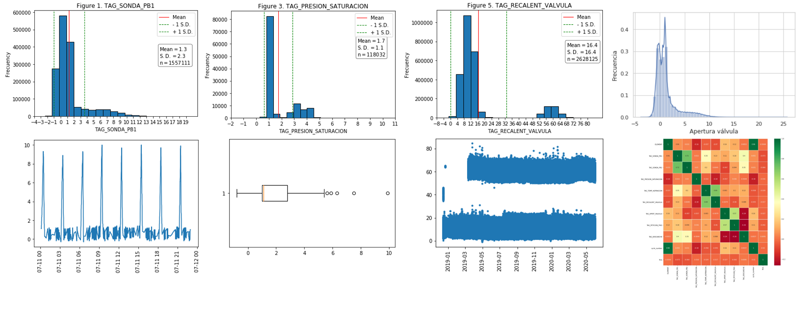

TFM: Detecccion de fallos en muebles frigorificos


## 1.  Descripción de Variables <a name="paginadescripcion"></a>

Para analizar las variables extraemos 5 Gbs de telemetria almacenamos en Bigquery entre proyectos, dicha carga se realiza de la siguiente forma:

```
from google.cloud import bigquery
from google.oauth2 import service_account
# TODO(developer): Set key_path to the path to the service account key
#                  file.
key_path = "Credentials.json"

credentials = service_account.Credentials.from_service_account_file(
    key_path, scopes=["https://www.googleapis.com/auth/cloud-platform"],
)

client = bigquery.Client(credentials=credentials, project=credentials.project_id,)
```
"Credentials.json"
[*Este archivo es unico y debe crearse por cada cuenta](https://cloud.google.com/docs/authentication/getting-started) 

```
query = """
SELECT
  TS,
  ELEMENT,
  TAG_SONDA_PB1,
  TAG_SONDA_PB2,
  TAG_PRESION_SATURACION,
  TAG_TEMP_ASPIRACION,
  TAG_RECALENT_VALVULA,
  TAG_APERT_VALVULA,
  TAG_EQUIPO_STANDBY,
  TAG_PETICION_FRIO,
  TAG_COMUNICA,
  TAG_DESCARCHE,
  TAG_ALARMA,
FROM
  `table-cloud-labpri-ctrlsenales.DAN_PIC_Europe.PIC_TRACK_VARIABLES_PREP` 
 
        """
#client = bigquery.Client(location="EU", project="table-cloud-labpri-ctrlsenales")


query_job = client.query(query,location="EU") 

df_Variables = query_job.to_dataframe()
df_Variables.head()
```


Notebook utilizacion para la descriopccion de la telemetria optenida de los muebles frigorificos y murales de frio.

    Identifiamos:

    * Outliers
    * Sensores descalibrados
    * Variables sin información
    * Variables dependientes

<br/>


