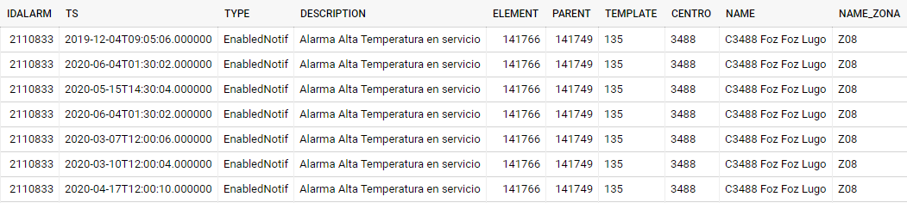

TFM Mercadona: Detecccion de fallos en muebles frigorificos

<br/>

## 2. Preprocesamiento de datos (Data Cleaning) <a name="Preprocesamientodeldatos"></a>

Para el procesamiento se realizaron las siguentes tranformaciones 

1. [Filtrado de alarmas críticas de la tabla de alarma.](#filtradoalarma)
2. Eliminamos outliers de la telemetría en la tabla de muebles frigoríficos y central de frio.
3. Realizamos un resample para generar las muestra y crear una data con un timestamp peridorico cada 1 min.
4. Rellenamos los valores faltantes de la table:
    * Para Variables categóricos realizamos un .fillna(method='ffill') donde propagamos los valores con el mismo valor
    * Para Variables continuas, realizamos una interpolación de valores
5. Realizamos un merge de las variables de cada mural con sus valores de la central de frio
6. Extraemos por medio de un merge, ventanas de 10 días de telemetría antes de las alarmas críticas filtradas en el primer paso 
7. Generamos 2 columnas nuevas:
    * (Clycle_number) Una Columna para identificar los ciclos (1 para cada alarma crítica)
    * (RUL)Una para identificar por min, la cantidad de minutos restantes hasta el momento del fallo


Procedemos a generar un dataset el cual será utilizado para el entrenamiento del algoritmo, de la siguiente forma:


Utilizamos la base de datos de las alarmas y filtramos de la siguiente manera:

<br/>
* filtramos las alarmas que habían sido generadas por murales de carne y murales de pescados ambos con controladores RX600.  <a name="filtradoalarma"></a>

| Field name|DESCRIPTION|  
| ----------|-------|
| Example      |Alarma Alta Temperatura en servicio  |

*filtramos el comienzo de la Alarma con la descripción Begin que cumpla la siguiente condición:    
    * No pueden haber estado inhabilitadas antes de su activación. sino la misma debería ser considerada como mantenimiento preventivo.

**Alarma Critica**
|   |TimeStand|TYPE|    
| ----------|-------|-------|
| Example      |1|EnabledNotif |
| Example      |2|InhibitNotif|
|**Example**     |**3**|**EnabledNotif**|
| Example      |4|Being  |
| Example      |5|End  |

**Alarma Desabilitada antes de su inicio**
|   |TimeStand|TYPE|    
| ----------|-------|-------|
| Example      |1|EnabledNotif |
| Example      |2|EnabledNotif|
| **Example**    |**3** |**InhibitNotif**|
| Example      |4|Being  |
| Example      |5|End  |

Dicho filtrado se realiza de la siguiente forma:


```
    for i, row  in df_Alarms.iterrows():
if (df_Alarms.loc[i,'ALTA_TEMPERATURA']) =='Begin' and  (df_Alarms.loc[i-1,'ALTA_TEMPERATURA'])!='InhibitNotif':
    df_Alarms.at[i,'new'] = 'True'
elif (df_Alarms.loc[i,'ALTA_TEMPERATURA']) =='Begin' and  (df_Alarms.loc[i-1,'ALTA_TEMPERATURA'])=='InhibitNotif':
    df_Alarms.at[i,'new'] = 'True but InhibitNotif by user'
else:
    df_Alarms.at[i,'new'] = 'False'     
``` 
* filtramos las alarmas que se hayan activado dentro de una misma locación en un rango menor a 10 días, evitando considerar alarmas críticas que no hayan podido ser reparadas.

```
    for i, row  in df_Alarms.iterrows():
        Days_before = **10**
        if i == 0:
            df_Alarms.at[i,'new2'] = 'True'
        elif (df_Alarms.loc[i,'ELEMENT']) == (df_Alarms.loc[i-1,'ELEMENT']):
            if ((df_Alarms.loc[i,'TS'])-(df_Alarms.loc[i-1,'TS'])).days >= Days_before:
                df_Alarms.at[i,'new2'] = 'True'
            else:
                df_Alarms.at[i,'new2'] = 'Too Short' 
        else:
            df_Alarms.at[i,'new2'] = 'True'  
``` 

Para Generar columna de ciclos unicos para cada alarma se realiza de la siguente forma:

```
def label_Cycle(data):
    cycles = data['cycle_number'].unique()
    df = pd.DataFrame([])
    for i  in range(len(cycles)):
        df_loop = data.loc[data['cycle_number']==cycles[i]]
        
        df_loop.loc[:,'cycle_number']=(i+1)
     
        df = df.append(df_loop).reset_index(drop=True)
    return(df)
    
df = label_Cycle(data_frame)
```


