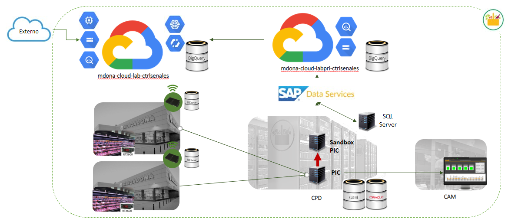
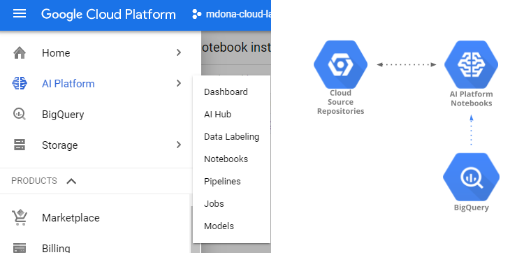

TFM Mercadona: Detecccion de fallos en muebles frigorificos

 

## Tabla de contenido

1. [Objetivo del proyecto](#Objetivo)
2. [Arquitectura](#Arquitectura)
3. [Base de datos](#datasets)
4. [librerias utilizadas](#software)
5. [Notebooks utilizados](#Notebooks)

## Objetivo del proyecto 

Prescribir la arquitectura que permita el tratamiento de más de 3 TB de datos. 

Descripción de variables obtenidas de un mueble frigorífico y central de frio.

Comparación de modelos para comprobar la viabilidad de un mantenimiento predictivo con histórico de 1.5 años.

## Arquitectura 

Se utilizo **SAP Data Services** para la extraccion de datos

Se utilizo **Google Cloud Platform** para almacenamiento y analitica de datos:

 

## Base de datos utilizadas 

Se utilizaron 5 tablas de datos:

    1. Historico de alarmas
    2. Telemetría de muebles frigoríficos
    3. Telemetría de central de frío
    4. Datos relacionales Zonas, centros, Tiendas y elementos
    5. Datos relacionales de Tiendas y sus coordenadas

1. PIC_TRACK_ALARM_ENRICH :
Base de datos de alarmas de todos los centros

| Field name|IDALARM|  TS      | TYPE     |DESCRIPTION| ELEMENT |  PARENT |TEMPLATE|CENTRO | NAME | NAME_ZONA|
| ----------|-------| ------- | -------- |-----------| --------|---------|------- |-------|------|----------|
| Type      |INTEGER|TIMESTAND|  STRING  |  STRING   |INTEGER  | INTEGER |STRING  |STRING |STRING |STRING   |

2. PIC_TRACK_VARIABLES_PREP (Telemetría de sensores de Muebles Frigorificos):
Base de datos de la telemetría de los distintos muebles frigoríficos obtenidos por controladores RX600

| Field name|TS|ELEMENT| TAG_SONDA_PB1|TAG_SONDA_PB2|TAG_PRESION_SATURACION|TAG_TEMP_ASPIRACION|TAG_RECALENT_VALVULA|TAG_APERT_VALVULA |TAG_EQUIPO_STANDBY|TAG_PETICION_FRIO|TAG_COMUNICA|TAG_DESCARCHE|TAG_ALARMA|
| ----------|-------| ------- | -------- |-----------| --------|---------|------- |-------|------|----------|------|------|------|
| Type      |TIMESTAND|INTEGER|  FLOAT  |  FLOAT   |FLOAT  | FLOAT |FLOAT  |FLOAT |FLOAT |FLOAT   |FLOAT   |FLOAT   |FLOAT   |

3. PIC_TRACK_VARIABLES_PREP_CENTRALFRIO (Telemetria de sensores de la central frigorífica):
Base de datos de la telemetría de la central frigorífica

| Field name|TS|  ELEMENT| NAME_CENTRO |TAG_ALARMA| TAG_COMPRESOR1 |  TAG_COMPRESOR2 |TAG_COMPRESOR3|TAG_COMPRESOR4 | TAG_COMPRESOR5 | TAG_COMPRESOR6|TAG_COMUNICA|	TAG_CONV_SETPOINT_ASP|	TAG_CONV_SETPOINT_COND|	TAG_CONV_SONDA_ASP|	TAG_CONV_SONDA_COND|	TAG_PASOMANUAL|	TAG_PASOMANUAL_AVERIA|TAG_PASOMANUAL_MTTO|TAG_POTENCIA_COMP1|TAG_POTENCIA_COMP2|TAG_POTENCIA_COMP3|TAG_POTENCIA_COMP4|	TAG_POTENCIA_COMP5|	TAG_POTENCIA_COMP6|	TAG_POTENCIA_INVERTER|	TAG_SETPOINT_ASP|TAG_SETPOINT_COND|	TAG_SONDA_ASP|	TAG_SONDA_COND|	TAG_SONDA_TEMP_EXT|	TAG_SONDA_TEMP_SUBENF|TAG_VENTILADOR1|	TAG_VENTILADOR2|	TAG_VENTILADOR3|TAG_VENTILADOR4|TAG_VENTILADOR5|	
| ----|-----| ----- | ------ |-----| ------|------|----- |-------|------|------|------|------|------|-----------| --------|---------|------- |-------|------|----------|------|------|------|------|------|------|------|-------|------|------|------|-------|------|------|------|------|
| Type  |TIMESTAND|INTEGER|  FLOAT  |  FLOAT   |FLOAT  | FLOAT |FLOAT  |FLOAT |FLOAT |FLOAT   |FLOAT   |FLOAT   |FLOAT |  FLOAT   |FLOAT  | FLOAT |FLOAT  |FLOAT |FLOAT |FLOAT   |FLOAT   |FLOAT   |FLOAT  |  FLOAT   |FLOAT   |FLOAT   |FLOAT  |FLOAT   |FLOAT   |FLOAT   |FLOAT  |  FLOAT   |FLOAT   |FLOAT   |FLOAT  |  FLOAT  |    

4. PIC_ELEMENT_LOCATION:

Base de datos con los identificados unicos por tiendas, elementos, zonas y centros

| Field name|ID_ELEMENT	|IDENTIFIER_ELEMENT	|NAME_ELEMENT	|DESCRIPTION_ELEMENT	|ABBREVIATION_ELEMENT	|ORDERPOSITION_ELEMENT	|PARENT_ELEMENT	|TEMPLATE_ELEMENT	|TEMPLATEPROPERTIES_ELEMENT	|TYPE_ELEMENT	|ID_LOCATION	|IDENTIFIER_LOCATION	|NAME_LOCATION	|DESCRIPTION_LOCATION	|PARENT_LOCATION	|TEMPLATE_LOCATION	|TYPE_LOCATION	|	
| ----------|-------| ------- | -------- |-----------| --------|---------|------- |-------|------|----------|------|------|------|-----------| --------|---------| --------|
| Type      |INTEGER|STRING|  STRING  |  STRING   |STRING  | INTEGER |INTEGER  |STRING |STRING |STRING   |INTEGER  |STRING |STRING |STRING   |INTEGER  |STRING |STRING |

5. PIC_TIENDA_COORDENADA:

Identificador de tiendas, altitud, longitud y altura con respecto al mar

| Field name|ALTITUD|  LONGITUD| ALTURA |TIENDA  |
| ----------|-------| -------- | ------ |------  |
| Type      |FLOAT  |FLOAT     |  FLOAT |INTEGER |

## librerias utilizadas 

* **python version 3.7 ** 
* **Pandas** : librería Python para Dataframes análisis
* **Numpy** : El paquete fundamental para la informática científica con Python
* **sklearn** : Scikit-learn es una biblioteca para aprendizaje automático de software libre
* **google** : Biblioteca de cliente de Cloud Storage para Python
* **matplotlib** : Biblioteca para la generación de gráficos a partir de datos contenidos en listas o arrays 
* **seaborn** : Biblioteca de visualización de datos de Python basada en matplotlib
* **dateutil** : Biblioteca para analisis de series temporales

## Notebooks utilizados 

1. [Descripción de Variables](1.Descripción_de_Variables/)
2. [Preprocesamiento de datos (Data Cleaning)](2.Preprocesamiento_de_datos/)
3. [Comparación de Modelos](3.Comparación_de_Modelos/)

## Authors
- Luis Araujo
- Miguel Ángel Aguilar
- Rocío Cort
- Victor Malvar

